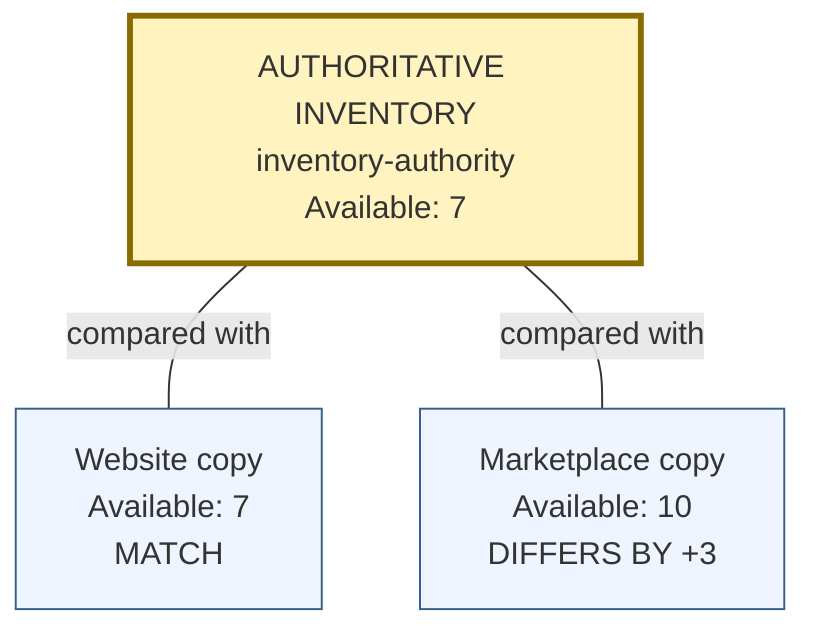

# Authoritative inventory and copies

```mermaid
flowchart TD
    A["AUTHORITATIVE INVENTORY<br/>inventory-authority<br/>Available: 7"]
    W["Website copy<br/>Available: 7<br/>MATCH"]
    M["Marketplace copy<br/>Available: 10<br/>DIFFERS BY +3"]
    A ---|compared with| W
    A ---|compared with| M
    classDef authority fill:#fff3bf,stroke:#8a6d00,stroke-width:3px
    classDef copy fill:#eef5ff,stroke:#35608a
    class A authority
    class W,M copy
```

The undirected lines describe comparisons, not automatic synchronization or
message flow. The authority is the reference point for both copies.
