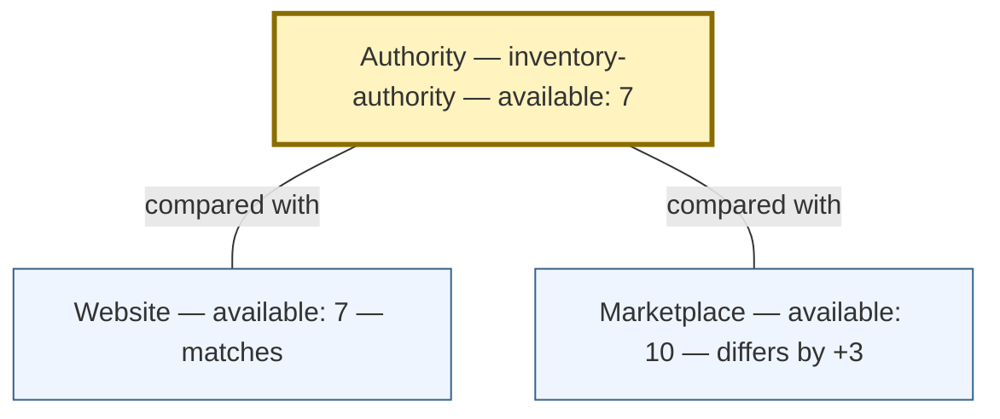

# Authoritative Inventory and Copies

```mermaid
flowchart TD
    A["Authority — inventory-authority — available: 7"]
    W["Website — available: 7 — matches"]
    M["Marketplace — available: 10 — differs by +3"]
    A ---|compared with| W
    A ---|compared with| M
    classDef authority fill:#fff3bf,stroke:#8a6d00,stroke-width:3px
    classDef copy fill:#eef5ff,stroke:#35608a
    class A authority
    class W,M copy
```

The undirected lines describe comparisons, not automatic synchronization or
message flow. The authority is the reference point for both copies.
