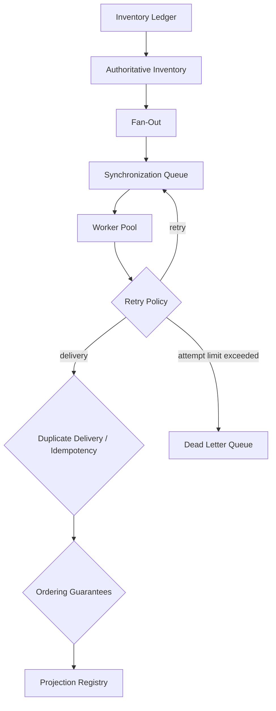

# End-to-End Operations Laboratory

The solid downward path is successful work. A retry returns the same immutable
request to the queue. Idempotency removes the effect of repeated delivery, while
revision ordering stops an older request from moving a projection backward.
Only work that exhausts its retry allowance enters the dead letter queue.
