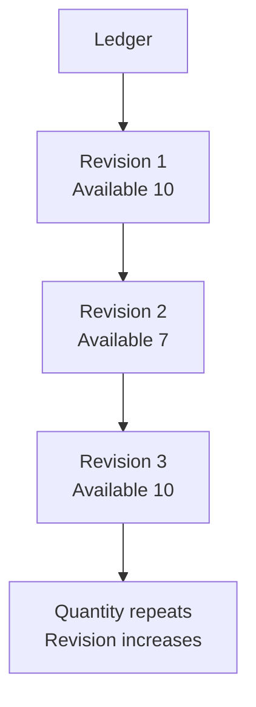

# Inventory Revisions

The downward path is ledger chronology. Available quantity returns to 10, while
the monotonically increasing revision distinguishes the later observation. The
diagram expresses ordering only, not synchronization policy or correctness.
