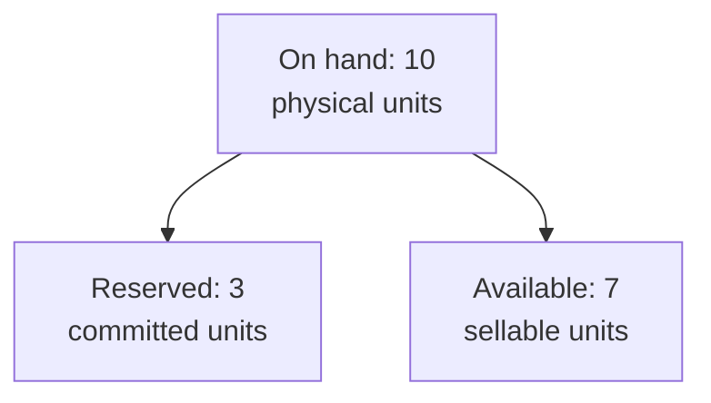

# Inventory State

```mermaid
flowchart TD
    OH["On hand: 10<br/>physical units"]
    R["Reserved: 3<br/>committed units"]
    A["Available: 7<br/>sellable units"]
    OH --> R
    OH --> A
```

The two children account for all ten on-hand units: `3 + 7 = 10`.
