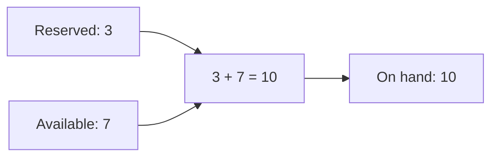

# Inventory State

```mermaid
flowchart LR
    R["Reserved: 3"] --> S["3 + 7 = 10"]
    A["Available: 7"] --> S
    S --> OH["On hand: 10"]
```

Reserved and available units account for all ten on-hand units: `3 + 7 = 10`.
