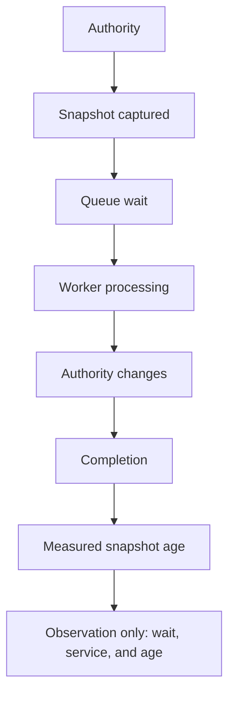

# Measuring Freshness

```mermaid
flowchart TD
    A[Authority] --> B[Snapshot captured]
    B --> C[Queue wait]
    C --> D[Worker processing]
    D --> E[Authority changes]
    E --> F[Completion]
    F --> G[Measured snapshot age]
    G --> H[Observation only: wait, service, and age]
```

The final record reports timing facts. It does not accept, reject, rank, or repair
the completed synchronization.
