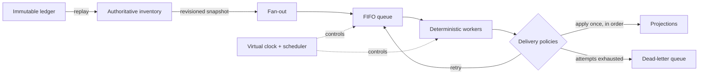

# Volume I Architecture

Volume I grows one model rather than presenting a finished system up front. Each
layer exists because an earlier chapter exposed a question the layer answers.
The result is deliberately in-memory and deterministic; it is architecture for
learning, not a production deployment blueprint.

This is a conceptual map. The [capstone diagram](../diagrams/end-to-end-operations-laboratory.md)
shows the Chapter 23 flow without replacing the chapter's detailed explanation.

## 1. Truth starts with inventory history

Chapters 1–4 define immutable `InventoryState` values and business events. An
`InventoryLedger` retains ordered events; replay derives the **authoritative
inventory**, so current truth is reproducible rather than maintained as an
unexplained mutable total. **Projections** are copied views for other purposes.
They may match authority or become stale, but they never redefine authority.

Relevant package areas: [`inventory.py`](../src/inventory_sim/inventory.py),
[`ledger.py`](../src/inventory_sim/ledger.py),
[`authority.py`](../src/inventory_sim/authority.py), and
[`projections.py`](../src/inventory_sim/projections.py).

## 2. Deterministic time makes movement observable

Chapters 5–9 add a **virtual clock** and **scheduler** before synchronization
transport. Direct copying establishes the baseline; FIFO **queues** make waiting
visible; fixed-capacity **workers** make start time, completion time, queue depth,
and assignment observable. Stable event and request ordering replaces wall-clock
sleeps, threads, and timing luck.

Relevant package areas: [`simulation.py`](../src/inventory_sim/simulation.py),
[`synchronization.py`](../src/inventory_sim/synchronization.py),
[`queues.py`](../src/inventory_sim/queues.py),
[`capacity.py`](../src/inventory_sim/capacity.py), and
[`worker_pool.py`](../src/inventory_sim/worker_pool.py).

## 3. Revisions turn staleness into a policy decision

Queueing reveals **stale snapshots**: authority can advance while captured work
waits. Freshness measurements first describe the age; monotonically increasing
**revisions** then identify relative order even when quantities happen to repeat.
Detection observes stale work, while rejection prevents that work from replacing
a newer view. A registry extends the same reasoning to multiple independent
projections.

Relevant package areas: [`stale_snapshots.py`](../src/inventory_sim/stale_snapshots.py),
[`freshness.py`](../src/inventory_sim/freshness.py),
[`revisions.py`](../src/inventory_sim/revisions.py),
[`stale_detection.py`](../src/inventory_sim/stale_detection.py),
[`stale_rejection.py`](../src/inventory_sim/stale_rejection.py), and
[`multiple_projections.py`](../src/inventory_sim/multiple_projections.py).

## 4. Distribution adds distinct failure modes

**Fan-out** creates one immutable synchronization request per projection. A
scripted failure motivates **retries**, which in turn reveal **duplicate
delivery**. An applied-request registry provides **idempotency**: repeated
delivery may occur, but its state-changing effect occurs once. Distinct requests
can also arrive out of order, so revision comparison supplies an **ordering**
guarantee that prevents backward movement. Bounded retry attempts finally route
terminal failures to a **dead-letter queue** without stopping healthy work.

Relevant package areas: [`fanout.py`](../src/inventory_sim/fanout.py),
[`retries.py`](../src/inventory_sim/retries.py),
[`duplicate_delivery.py`](../src/inventory_sim/duplicate_delivery.py),
[`idempotency.py`](../src/inventory_sim/idempotency.py),
[`out_of_order.py`](../src/inventory_sim/out_of_order.py),
[`ordering.py`](../src/inventory_sim/ordering.py), and
[`dead_letter.py`](../src/inventory_sim/dead_letter.py).

## 5. The end-to-end laboratory composes the layers

Chapter 23's [`laboratory.py`](../src/inventory_sim/laboratory.py) introduces no
new educational mechanism. It combines immutable state and ledger replay,
authority and revisioned projections, virtual time, fan-out, queueing and worker
capacity, scripted retries, duplicate suppression, ordering checks, and dead-
letter isolation. Because all inputs and ordering decisions are fixed, its CLI
trace is a repeatable explanation of the whole Volume I system.

## Boundaries and navigation

The package root in [`__init__.py`](../src/inventory_sim/__init__.py) defines the
supported Python API. The [`cli/`](../src/inventory_sim/cli/main.py) package is a
presentation layer organized into the same four learning parts; it does not own
simulation behavior. Tests exercise each layer independently before the capstone
composes them.

Return to the [documentation index](README.md), study the precise chapter order
in the [learning path](learning-path.md), or read why these layers avoid external
infrastructure in the [design philosophy](design-philosophy.md).
